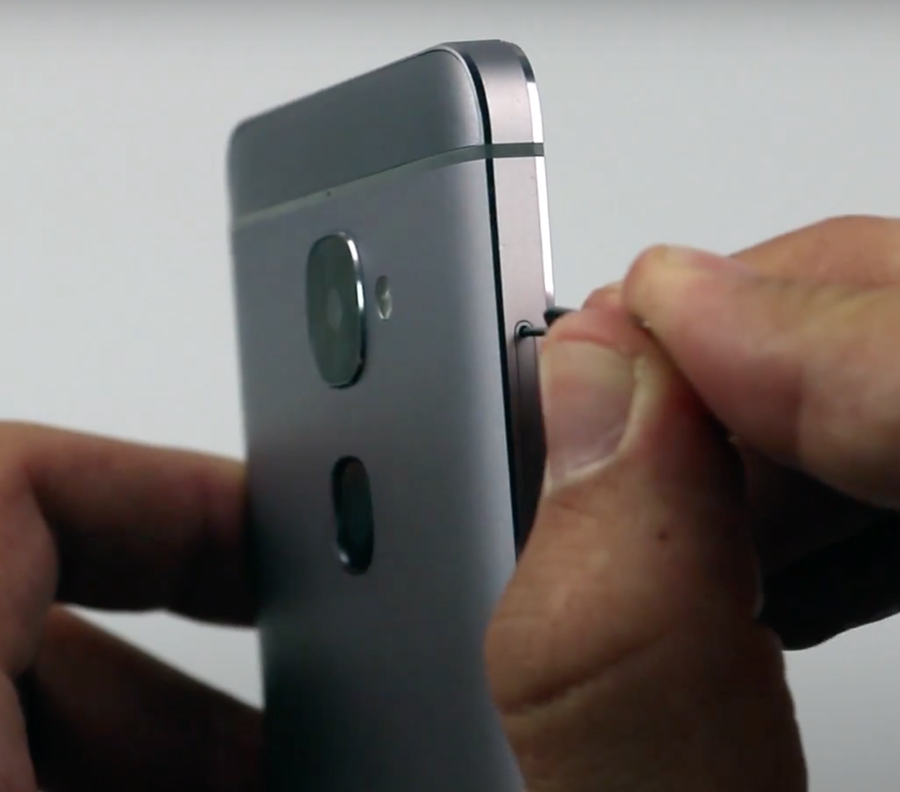
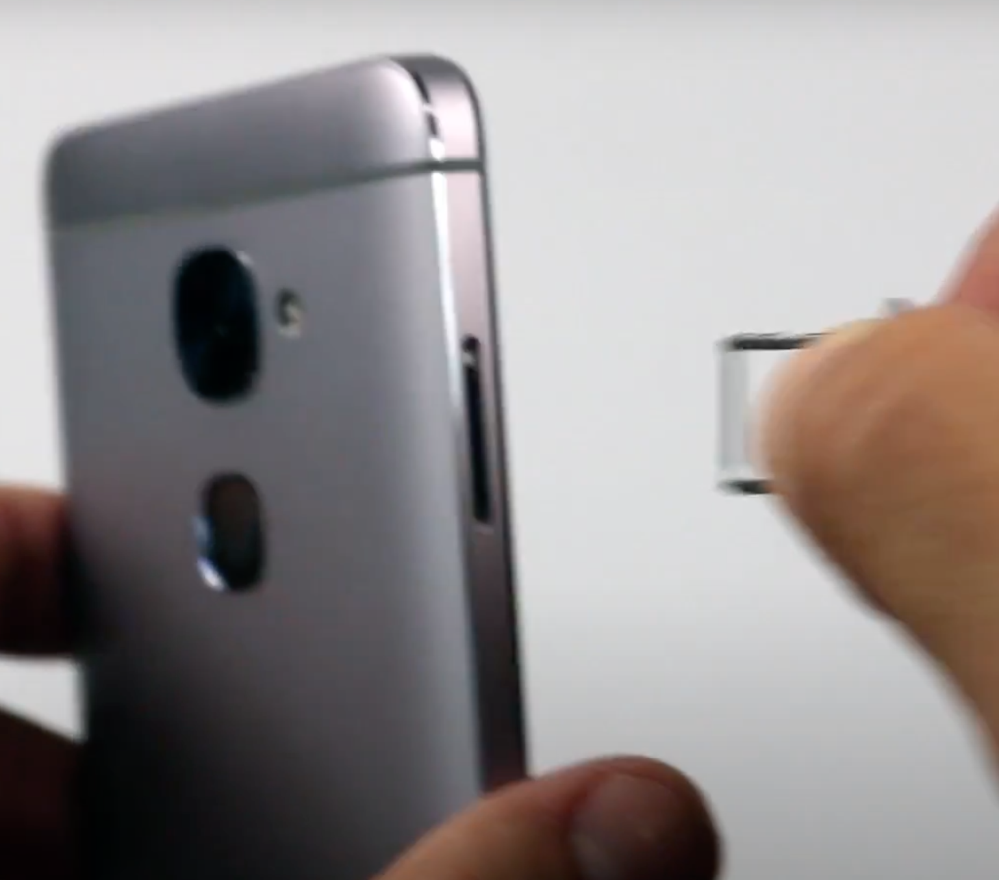
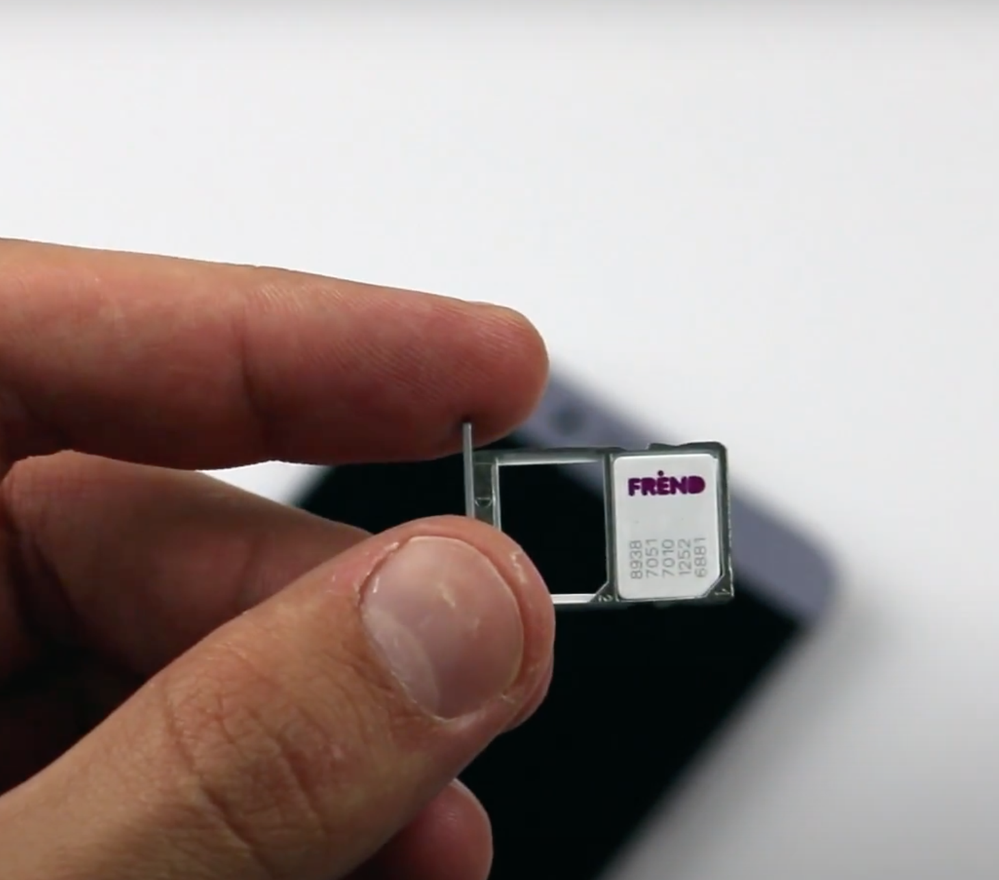
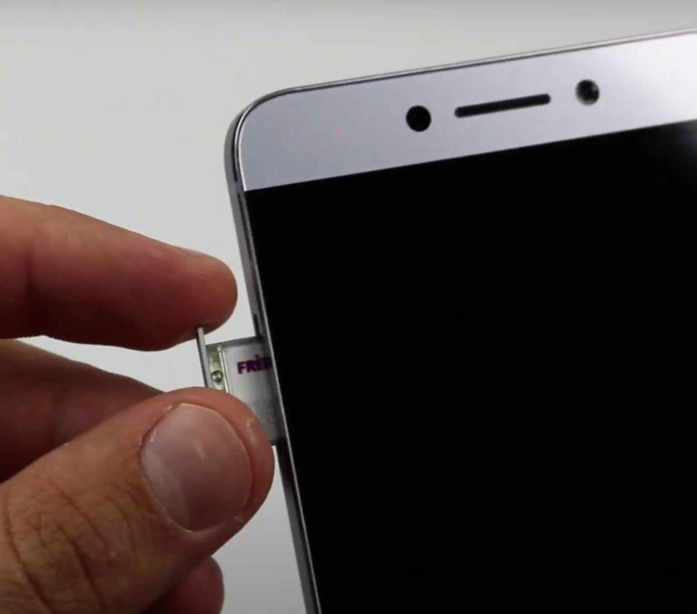

# M1 Freedom Router Guide 

## SIM Card

### Choosing a Sim

Choosing the correct SIM card is an important step of securing good mobile internet. Your maximum data speeds will always be bounded by the connection speed of your carrier in your location. 

To setup your router, you have 2 basic options:   

1) __Postpaid (Always Recommended)__

- significantly faster speed
- more reliable
- best for using as home internet solution
- must setup in store

2) __Prepaid (Not Recommended)__

- slower
- can be setup online

Use table below for plan comparison:  

|                | Postpaid         | Prepaid             |
| -----------         | -----------      | ---                 |
| Speed               |  ✅ Up to 100+ mbps   | ❌ Up to 35 mbps        |
| Cost | ✅ $50 or less per month | ✅ $50 or less per month |
| Contract  |  ✅ No Contract Required    |  ✅ No Contract Required     |
| Term | ✅ month-to-month | ✅ month-to-month |
| Setup |  In store required | Online |

---

### Installation

1) Eject sim card tray will tool provided  
2) Extract tray from device  
3) Add SIM to tray  
4) Insert tray back to phone
5) Reboot device

---

## Setup
  
### Configure Wifi

__Turning on Wifi Hotspot__

Settings > Wifi and Hotspot > Turn on Hotspot

__Setting Wifi Name and Password__

Settings > Wifi and Hotspot > Set Wifi Username and Password

### Location in House

Before placing your router, be sure to check your baseline data speed, known as your "base speed" in that location. To do that, open your internet browser and run a simple speed test. Repeat for all possible router locations. Choose the location which provides the best base speed and is still able to reach connected devices over Wifi.

General Tips:  
- look for a central location in the house. 
- higher elevations are better (ex: upstairs > downstairs)
- check your "base speed" before placement

------

# VPN Guide

> Use this guide if you would like to use Open Internet VPN to block throttling and get faster speeds while using video streaming services such as Netflix.

## Creating an account

1) Go to https://vpn.openinternet.cc  
2) Register your email. Make sure to use the same email you use for billing on your purchase.  

## How to purchase

1) Go to https://openinternet.cc/shop  
2) Add VPN to your cart  
3) Continue to checkout. Make sure to add the correct billing email that will be tied to your account.  

> If you have any issues, please reach out to us at support@openinternet.cc

## Setup

1) Turn on your Open Internet router device. 
2) Make sure it's connected to internet. 
3) Open the "Wireguard VPN" application. 
4) Click the blue "+" button and select "scan from QR code". 
5) Give your VPN tunnel a name, then activate it by clicking the grey slider. It will show blue when activated. 
7) Congratulations! You are now connected to Open Internet VPN and your cellular carrier will not be able to see your traffic. 

---

# General Troubleshooting 

## Internet is not working

1) Check internet connection on router. Open "browser" app and search google. If no internet, continue to step 2. Else, if internet is working on router but not devices, make sure your hotspot is turned on and devices are within range.   
2) If you are running VPN, try turning turning it off, and check internet connection again. If internet is now working, the problem is with VPN. Please send email to support@openinternet.cc  
3) If internet is still not working after the above troubleshooting steps, it is probably a problem with the data connection to carrier. If you are running prepaid plan, data outages can sometimes occur. Please try calling the carrier by dialing 6-1-1 on your device.   

## Additional Support

For any additional questions or concerns, please reach out to us:
- [product support email](mailto://support@openinternet.cc)
- [discord community](https://discord.gg/e5SeQV79Ru)

